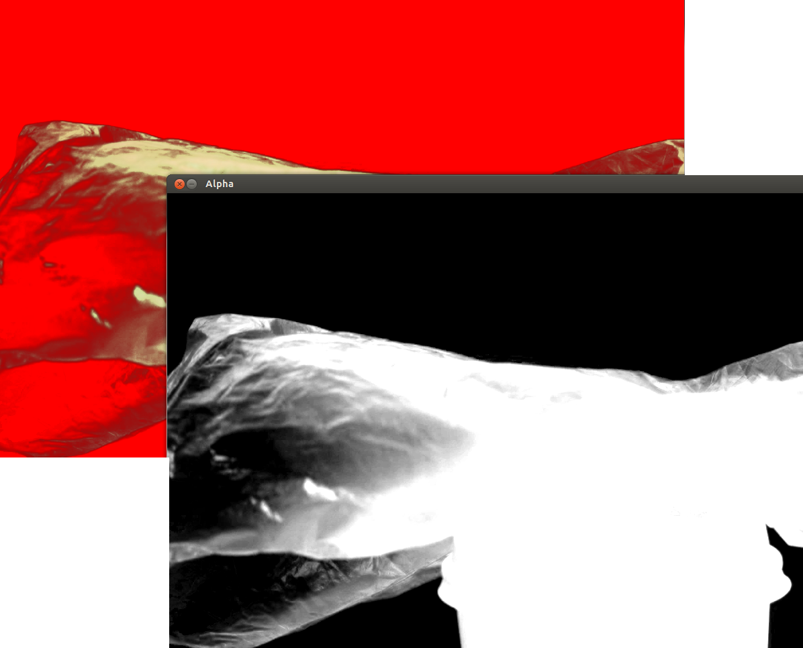

The second part of my 2015 summer internship, this algorithm removes
the background of an image using a Primatte-inspired algorithm.

Dependencies:
  * QGlViewer is needed for previewing the 3D data.
  * OpenCV is used for image handling and processing.

It was designed to be easy to use and adapt, with many of the sub
algorithms being replacable. The Overview.png image describes visually
in some detail how it works, but a greater understanding will be achieved
through reviewing the code and comments.

The usage interface was inspired by the DirectX model, where a descriptor
must first be created and filled out before being passed to an object.
In this case, the user must create an InputAssembler to load the input,
and an Algorithm to use it.

An example usage is shown in application.cpp, in the init() method.
It is heavily commented and should serve as a good starting point!

Description of the files:
* io - The IO file contains debug output functions and macros, such as timer helpers.
* algorithmprimatte - This is the main core of the primatte-inspired algorithm.
* alphalocator - This contains classes that implement the ialphalocator interface.
* application - The application driver and 3D previewer.
* averagebackgroundcolourlocators - Classes that implement the iaveragebackgroundcolourlocator interface.
* boundingpolyhedron - A class that inherits from spherepolyhedron, adding fitting functionality.
* coloursegmenters - Classes that implement the icoloursegmenter interface.
* ialgorithm - The algorithm interface. Currently only algorithmprimatte is available.
* ialphalocator - A class implementing this is reponsible for generating the alpha image given the polyhedra.
* iaveragebackgroundcolourlocator - Must find the dominant background point given an image in any colour space.
* icoloursegmenter - Must split the points into Inner and Outer according to a centre point and a distance parameter.
* ifittingalgorithm - Must be able to shrink and expand a polyhedron around points.
* inputassembler - Loads and stores the input.
* matrixd - Linear algebra code. Only the vectors are used throughout the program.
* spherepolyhedron - A carefully constructed UV Sphere polyhedron that allows fast ray-triangle intersection.

Known issues:
* There is a really small inaccuracy in ray-triangle intersection if the ray is close to a horizontal edge.

Possible optimisations:
* Much of alpha interpolation code could be moved to the GPU, yielding a substantial performance gain.
* Changing the system to use 8-bit images could speed up the input processing stage.
* Currently, the system attempts to find the alpha for each pixel, even if some pixels are not unique. Changing this could
  result in optimisations ranging from the alpha interpolation having to be invoked for less pixels, to colourspace conversion
  being needed for only the unique pixels.

Supported colourspaces:
* RGB - This is the fastest, as it requires least conversion. It's more suitable for compressed images as well.
* HSV - Not really suitable for anything. Just left there for completeness . . . . The hue wraps around, which isn't good for distance comparisons.
* LAB - The optimal choice for uncompressed images.
